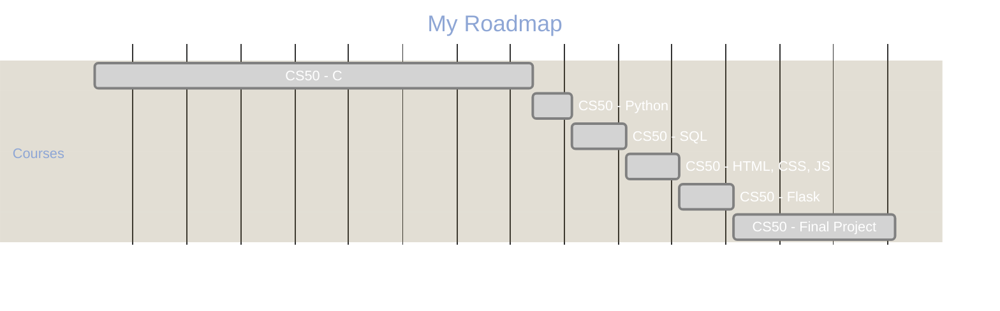
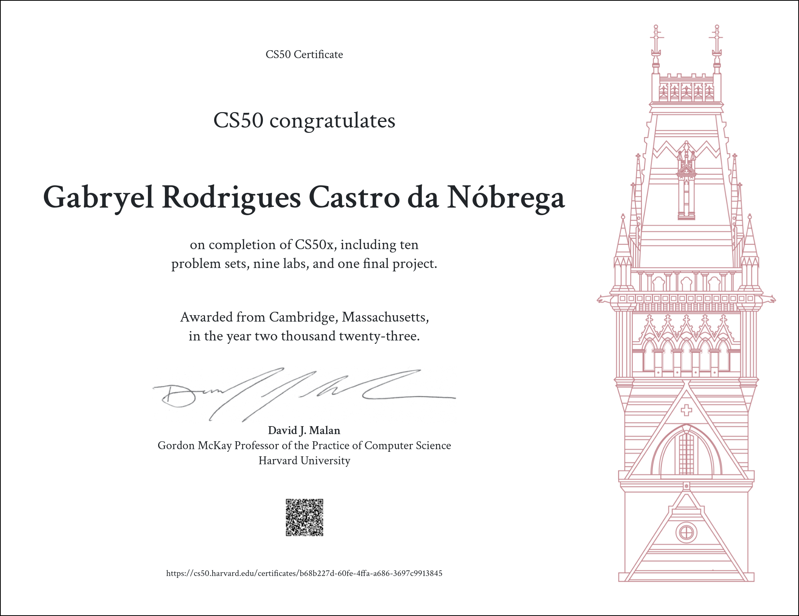

# CS50 - Introduction to Computer Science

This material is distributed by `Harvard © 2023 edX LLC`. It was copied during the execution of the Course, and have been modified due to my understanding and integrated to the previous Data Structure of `Programing Studies`.

---

	Much awaits you, so here's how to begin!

 
First join some of CS50's communities, so that you can reach out to classmates and staff with questions:

1.  If you're the YouTube type:
    -   subscribe to CS50's channel at [youtube.com/cs50](http://www.youtube.com/subscription_center?add_user=cs50tv)
2.  If you're the TikTok type:
    -   follow [@cs50](https://www.tiktok.com/@cs50)
    -   follow [@davidjmalan](https://www.tiktok.com/@davidjmalan)
3.  If you're the LinkedIn type:
    -   connect with (and say hello to!) David at [linkedin.com/in/malan](https://www.linkedin.com/in/malan)
4.  If you're the Instagram type:
    -   follow [cs50](https://instagram.com/cs50)
    -   follow (and say hello to!) [davidjmalan](https://instagram.com/davidjmalan)
5.  If you're the Twitter type:
    -   follow [@cs50](https://twitter.com/cs50)
    -   say hello to classmates with hashtag #[cs50](https://twitter.com/intent/tweet?hashtags=cs50)
    -   follow (and say hello to!) [@davidjmalan](https://twitter.com/davidjmalan)
6.  If you're the Discord type:
    -   join CS50's Discord server at [discord.gg/cs50](https://discord.gg/cs50)
7.  If you're the Facebook type:
    -   join CS50's Facebook Group at [facebook.com/groups/cs50](https://www.facebook.com/groups/cs50)
    -   like CS50's Facebook Page at [facebook.com/cs50](https://www.facebook.com/cs50)
    -   follow (and say hello to!) David at [facebook.com/dmalan](https://www.facebook.com/dmalan)
8.  If you're the Snapchat type:
    -   add [cs50](https://www.snapchat.com/add/cs50)

After that, watch each of the course's lectures and submit the course's labs, problem sets, and final project:

1.  Watch [Week 0](https://learning.edx.org/course/course-v1:HarvardX+CS50+X/block-v1:HarvardX+CS50+X+type@sequential+block@a8730f85a9a94d41a784a58c4b6d8bdc/block-v1:HarvardX+CS50+X+type@vertical+block@31304400fd444ea9860a8833cce5c248)'s lecture. Submit [Problem Set 0](https://cs50.harvard.edu/x/2023/psets/0/).
2.  Watch [Week 1](https://learning.edx.org/course/course-v1:HarvardX+CS50+X/block-v1:HarvardX+CS50+X+type@sequential+block@376b3893fe2a45f4b3fec7335b3c8640/block-v1:HarvardX+CS50+X+type@vertical+block@207e2527aef54d78a423fd22e18d93ee)'s lecture and, optionally, shorts and section. Submit [Lab 1](https://cs50.harvard.edu/x/2023/labs/1/) and [Problem Set 1](https://cs50.harvard.edu/x/2023/psets/1/).
3.  Watch [Week 2](https://learning.edx.org/course/course-v1:HarvardX+CS50+X/block-v1:HarvardX+CS50+X+type@sequential+block@bbb214a2ef2549e68d7fec9fd5667b7d/block-v1:HarvardX+CS50+X+type@vertical+block@ec5c719fbd6349d09a10ddaafb03af31)'s lecture and, optionally, shorts and section. Submit [Lab 2](https://cs50.harvard.edu/x/2023/labs/2/) and [Problem Set 2](https://cs50.harvard.edu/x/2023/psets/2/).
4.  Watch [Week 3](https://learning.edx.org/course/course-v1:HarvardX+CS50+X/block-v1:HarvardX+CS50+X+type@sequential+block@ea2b55b5e6884be0b9c6764efb3341b7/block-v1:HarvardX+CS50+X+type@vertical+block@a4fa564ff2c04130bb5ba84ef2bb7ff0)'s lecture and, optionally, shorts and section. Submit [Lab 3](https://cs50.harvard.edu/x/2023/labs/3/) and [Problem Set 3](https://cs50.harvard.edu/x/2023/psets/3/).
5.  Watch [Week 4](https://learning.edx.org/course/course-v1:HarvardX+CS50+X/block-v1:HarvardX+CS50+X+type@sequential+block@65cdc65777b4421781a6197887d12fd7/block-v1:HarvardX+CS50+X+type@vertical+block@83496dc9b595438997f733f71807f43b)'s lecture and, optionally, shorts and section. Submit [Lab 4](https://cs50.harvard.edu/x/2023/labs/4/) and [Problem Set 4](https://cs50.harvard.edu/x/2023/psets/4/).
6.  Watch [Week 5](https://learning.edx.org/course/course-v1:HarvardX+CS50+X/block-v1:HarvardX+CS50+X+type@sequential+block@777300888dd848568a9c37e53cbc3246/block-v1:HarvardX+CS50+X+type@vertical+block@57d2b52d29e84423a0ed933ad23b227a)'s lecture and, optionally, shorts and section. Submit [Lab 5](https://cs50.harvard.edu/x/2023/labs/5/) and [Problem Set 5](https://cs50.harvard.edu/x/2023/psets/5/).
7.  Watch [Week 6](https://learning.edx.org/course/course-v1:HarvardX+CS50+X/block-v1:HarvardX+CS50+X+type@sequential+block@0d0d972b09b94da1aa23e991ef331afd/block-v1:HarvardX+CS50+X+type@vertical+block@b6f3d34ee94748bb9bfe4dd4389349ce)'s lecture and, optionally, short. Submit [Lab 6](https://cs50.harvard.edu/x/2023/labs/6/) and [Problem Set 6](https://cs50.harvard.edu/x/2023/psets/6/).
8.  Watch [Week 7](https://learning.edx.org/course/course-v1:HarvardX+CS50+X/block-v1:HarvardX+CS50+X+type@sequential+block@ba11fd5c31a34e47b7af3708832162c5/block-v1:HarvardX+CS50+X+type@vertical+block@8b295a7f30e84e0c8242769dc4fc5a96)'s lecture and, optionally, short. Submit [Lab 7](https://cs50.harvard.edu/x/2023/labs/7/) and [Problem Set 7](https://cs50.harvard.edu/x/2023/psets/7/).
9.  Watch [Week 8](https://learning.edx.org/course/course-v1:HarvardX+CS50+X/block-v1:HarvardX+CS50+X+type@sequential+block@638af9550b164582b9bc6c1b0e562881/block-v1:HarvardX+CS50+X+type@vertical+block@b01c03067cfb495f891a1a7b4c645a53)'s lecture and, optionally, shorts and section. Submit [Lab 8](https://cs50.harvard.edu/x/2023/labs/8/) and [Problem Set 8](https://cs50.harvard.edu/x/2023/psets/8/).
10.  Watch a special lecture on [Cybersecurity](https://learning.edx.org/course/course-v1:HarvardX+CS50+X/block-v1:HarvardX+CS50+X+type@sequential+block@5b2ceb61052c4e15b7cbc30bd86ab242/block-v1:HarvardX+CS50+X+type@vertical+block@eaae1f2aa20e45d2a1b911c0d6cb66bc).
11.  Watch [Week 9](https://learning.edx.org/course/course-v1:HarvardX+CS50+X/block-v1:HarvardX+CS50+X+type@sequential+block@c7937ee528344aefbedb3628638940bb/block-v1:HarvardX+CS50+X+type@vertical+block@53df817830294add8cc1536f26494a43)'s lecture and, optionally, shorts and section. Submit [Lab 9](https://cs50.harvard.edu/x/2023/labs/9/) and [Problem Set 9](https://cs50.harvard.edu/x/2023/psets/9/).
12.  Watch [Week 10](https://learning.edx.org/course/course-v1:HarvardX+CS50+X/block-v1:HarvardX+CS50+X+type@sequential+block@5f830906ea764494ad216f3b2a4b9669/block-v1:HarvardX+CS50+X+type@vertical+block@e7b0a40138a9474a8142d816ceb9a9e1)'s lecture.
13.  Optionally watch some [Seminars](https://cs50.harvard.edu/x/2023/seminars/).
14.  Submit the [Final Project](https://cs50.harvard.edu/x/2023/project/).

---

# Course Progress  
> To view your current progress in the course projects, visit [cs50 gradebook](https://cs50.me/cs50x)!

## Week 0

| CS50x 2023 😀                         |                                      | Done? |
| ------------------------------------- | ------------------------------------ | ----- |
| [Week 0 - Scratch](./week0/README.md) | [`Scratch`](./week0/problem_set0.md) | ✅    |

## Week 1

| CS50x 2023 😀                   |                                                 | Done? |
| ------------------------------- | ----------------------------------------------- | ----- |
| [Week 1 - C](./week1/README.md) | `C`                                             | ✅    |
| -                               | `C` [Practice Problems 1](./week1/problems1.md) | :x:   |
| -                               | `C` [Lab 1: Population](./week1/lab1.md)        | ✅    |
| -                               | `C` [Hello](./week1/hello.md)                   | ✅    |
| -                               | `C` [Mario](./week1/mario.md) (more)            | ✅    |
| -                               | `C` [Cash or Credit](./week1/cash_credit.md)    | ✅    |

## Week 2

| CS50x 2023 😀                        |                                             | Done? |
| ------------------------------------ | ------------------------------------------- | ----- |
| [Week 2 - Arrays](./week2/README.md) | `C` Arrays                                  | ✅    |
| -                                    | `C` [Lab 2: Scrabble](./week2/lab2.md)      | ✅    |
| -                                    | `C` [Readability](./week2/readability.md)   | ✅    |
| -                                    | `C` [Bulbs](./week2/bulbs.md)               | ✅    |
| -                                    | `C` [Caesar](./week2/caesar.md)             | :x:   |
| -                                    | `C` [Substitution](./week2/substitution.md) | :x:   |
| -                                    | `C` [Wordle50](./week2/wordle50.md)         | :x:   |

## Week 3

| CS50x 2023 😀               |                                                                            | Done? |
| --------------------------- | -------------------------------------------------------------------------- | ----- |
| [Week 3](./week3/README.md) | `C` Algorithms                                                             | ✅    |
| -                           | `C` Practice Problems 3 - [Recursive `atoi`](./week3/src/recursive_atoi.c) | ✅    |
| -                           | `C` [Lab 2: Sort](./week3/lab3.md)                                         | ✅    |
| -                           | `C` [Plurality](./week3/plurality.md)                                      | ✅    |
| -                           | `C` [Runoff](./week3/runoff.md)                                            | ✅    |
| -                           | `C` [Tidman](./week3/tidman.md)                                            | :x:   |

## Week 4

| CS50x 2023 😀               |                                        | Done? |
| --------------------------- | -------------------------------------- | ----- |
| [Week 4](./week4/README.md) | `C` Memory                             | ✅    |
| -                           | `C` Practice Problems 4                | :x:   |
| -                           | `C` [Lab 4: Simley](./week4/smiley.md) | ✅    |
| -                           | `C` [Lab 4: Volume](./week4/volume.md) | :x:   |
| -                           | `C` [Filter](./week4/filter.md)        | ✅    |
| -                           | `C` [Recover](./week4/recover.md)      | ✅    |
| -                           | `C` [Reverse](./week4/reverse.md)      | :x:   |

## Week 5

| CS50x 2023 😀               |                                           | Done? |
| --------------------------- | ----------------------------------------- | ----- |
| [Week 5](./week5/README.md) | `C` Data Structures                       | ✅    |
| -                           | `C` Practice Problems 5                   | :x:   |
| -                           | `C` [Lab 5: Inheritance](./week5/lab5.md) | ✅    |
| -                           | `C` [Speller](./week5/speller.md)         | ✅    |

## Week 6

| CS50x 2023 😀               |                                                | Done? |
| --------------------------- | ---------------------------------------------- | ----- |
| [Week 6](./week6/README.md) | `Python`                                       | ✅    |
| -                           | `Python` Practice Problems 6                   | :x:   |
| -                           | `Python` [Lab 6: World Cup](./week6/lab6.md)   | ✅    |
| -                           | `Python` [Mario](./week6/mario.md) (more)      | ✅    |
| -                           | `Python` [Cash](./week6/cash.md)               | ✅    |
| -                           | `Python` [Credit](./week6/credit.md)           | :x:   |
| -                           | `Python` [Readability](./week6/readability.md) | ✅    |
| -                           | `Python` [DNA](./week6/dna.md)                 | ✅    |

## Week 7

| CS50x 2023 😀               |                                           | Done? |
| --------------------------- | ----------------------------------------- | ----- |
| [Week 7](./week7/README.md) | `Python` / `SQL`                          | ✅    |
| -                           | `SQL` Practice Problems 7                 | :x:   |
| -                           | `SQL` [Lab 7: Songs](./week7/lab7.md)     | ✅    |
| -                           | `SQL` [Movies](./week7/movies.md)         | ✅    |
| -                           | `SQL` [Fiftyville](./week7/fiftyville.md) | ✅    |

## Week 8

| CS50x 2023 😀               |                                                                           | Done? |
| --------------------------- | ------------------------------------------------------------------------- | ----- |
| [Week 8](./week8/README.md) | `HTML`, `CSS`, `JavaScript`                                               | ✅    |
| -                           | `HTML`, `CSS`, `JavaScript` [Practice Problems 8 - Redo](./week8/redo.md) | ✅    |
| -                           | `HTML`, `CSS`, `JavaScript` [Lab 8: Trivia](./week8/lab8.md)              | ✅    |
| -                           | `HTML`, `CSS`, `JavaScript` [Homepage](./week8/homepage.md)               | ✅    |

## Plus

| CS50x 2023 😀            |               | Done? |
| ------------------------ | ------------- | ----- |
| [Plus](./plus/README.md) | Cybersecurity | ✅    |

## Week 9

| CS50x 2023 😀               |                                              | Done? |
| --------------------------- | -------------------------------------------- | ----- |
| [Week 9](./week9/README.md) | `Flask`                                      | ✅    |
| -                           | `Flask` Practice Problems 9                  | :x:   |
| -                           | `Flask` [Lab 9 - Birthdays](./week9/lab9.md) | ✅    |
| -                           | `Flask` [Finance](./week9/finance.md)        | ✅    |

## Week 10

| CS50x 2023 😀                 |                                  | Done? |
| ----------------------------- | -------------------------------- | ----- |
| [Week 10](./week10/README.md) | Emoji                            | ✅    |
| -                             | [Seminars](./week10/seminars.md) | :x:   |

## Final Project

| CS50x 2023 😀                        |               | Done? |
| ------------------------------------ | ------------- | ----- |
| [Final Project](./p-final/README.md) | Final Project | ✅    |

---

## Contributing

Pull requests are welcome. For major changes, please open an issue first to discuss what you would like to change. Please make sure to update tests as appropriate.

---

## Certificate

