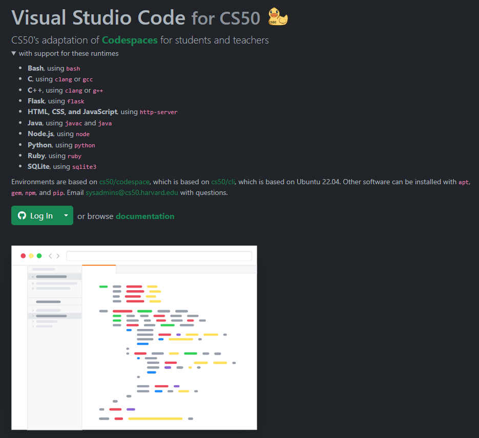

> This material is distributed by `Harvard © 2023 edX LLC`. It was copied during the execution of the Course, and have been modified due to my understanding and integrated to the previous Data Structure of `Programing Studies`.

<details> <summary>Table of Contents</summary>

- [Lecture 1](#lecture-1)
  - [Welcome!](#welcome)
  - [Hello World](#hello-world)
  - [Functions](#functions)
  - [Variables](#variables)
  - [Conditionals](#conditionals)
  - [Loops](#loops)
  - [Linux and the Command Line](#linux-and-the-command-line)
  - [Mario](#mario)
  - [Comments](#comments)
  - [Abstraction](#abstraction)
  - [Operators and Types](#operators-and-types)
  - [Summing Up](#summing-up)
- [Section 1](#section-1)
- [Shorts](#shorts)
  - [Data Types](#data-types)
    - [Operators](#operators)
  - [Conditional Statements](#conditional-statements)
  - [Loops](#loops-1)
  - [Command Line](#command-line)
  - [Lab 1 - Population](#lab-1---population)
  - [Problem Set 1](#problem-set-1)
  - [What to Do](#what-to-do)
  - [Practice Problems](#practice-problems)

</details>

---

# Lecture 1

<details>
<summary>Keywords, lookup in <a href="./src/transcripts/lecture1.md">transcript</a></summary>

- Source code
- Machine code
- Compiler
- Correctness
- design
- style
- IDE
- CLI x GUI
- Syntax highlighting
- Common mistakes
- Header files
- Assignment
- Counter
- Loops
- Initialize
- Cancel (infinite loop)
- Linux commands (`unix`)
- Comments
- Memory size
- integer overflow
- Truncation
- Type casting
- floating-point imprecision

</details>

## Welcome!

-   In our previous session, we learned about Scratch, a visual programming language.
-   Indeed, all the essential programming concepts presented in Scratch will be utilized as you learn how to program any programming language.
-   Recall that machines only understand binary. Where humans write _source code_, a list of instructions for the computer that is human readable, machines only understand what we can now call _machine code_. This machine code is a pattern of ones and zeros that produces a desired effect.
-   It turns out that we can convert _source code_ into `machine code` using a very special piece of software called a _compiler_. Today, we will be introducing you to a compiler that will allow you to convert source code in the programming language _C_ into machine code.
-   Today, in addition to learning about how to code, you will be learning about how to write good code.
-   Code can be evaluated upon three axes. First, _correctness_ refers to “does the code run as intended?” Second, _design_ refers to “how well is the code designed?” Finally, _style_ refers to “how aesthetically pleasing and consistent is the code?”

## Hello World

-   The compiler that is utilized for this course is _Visual Studio Code_, affectionately referred to as , which can be accessed via that same url, or simply as *VS Code.*
-   One of the most important reasons we utilize VS Code is that it has all the software required for the course already pre-loaded on it. This course and the instructions herein were designed with VS Code in mind. Best always to utilize VS Code for assignments in this course.
-   You can open VS Code at [code.cs50.io](https://code.cs50.io/).
	
-   The compiler can be divided into a number of regions:
    
    
    
    Notice that there is a _file explorer_ on the left side where you can find your files. Further, notice that there is a region in the middle called a _text editor_ where you can edit your program. Finally, there is a `command line interface`, known as a _CLI_, _command line_, or _terminal window_ where we can send commands to the computer in the cloud.
    
-   We can build your first program in C by:

    1.  typing `code hello.c` into the terminal window, **to create a brand new file**.

        ```bash
        $ code hello.c
        ```
        Notice that we deliberately lowercased the entire filename and included the `.c` extension. 

    2.  Then, in the text editor that appears, write code as follows:
        
        ```c
        #include <stdio.h>
        
        int main(void)
        {
            printf("hello, world\n");
        }
        ```
        Note that every single character above serves a purpose. *If you type it incorrectly, the program will not run*.

    3.  Clicking back in the terminal window, you can compile your code by executing

        ```bash
        $ make hello
        ```
        Notice that we are omitting `.c`. `make` is a compiler that will look for our `hello.c` file and turn it into a program called `hello`. If executing this command results in no errors, you can proceed. If not, double-check your code to ensure it matches the above.

    4.  Now, type the following:
        ```bash
        ./hello
        ```
        And your program will execute saying `hello, world`. This command oppens the executable file.

-   In the _file explorer_ on the left. You will notice that there is now both a file called `hello.c` and another file called `hello`. `hello.c` is able to be read by the compiler: It’s where your code is stored. `hello` is an executable file that you can run, but cannot be read by the compiler.
    

## Functions

-   In *Scratch*, we utilized the `say` block to display any text on the screen. Indeed, in **C**, we have a function called `printf` that does exactly this.
-   Notice our code already invokes this function:
    
    ```c
    printf("hello, world\n");
    ```
    
    Notice that the printf function is called. The argument passed to printf is ‘hello, world\\n’. The statement of code is closed with a `;`.
    
-   A common error in C programming is the omission of a semicolon. Modify your code as follows:
    
    ```c
    #include <stdio.h>
    
    int main(void)
    {
        printf("hello, world\n")
    }
    ```
    
    **Notice the semicolon is now gone**.
    
-   In your terminal window, run `make hello`. You will now be met with numerous errors! Placing the semicolon back in the correct position and running `make hello` again, the errors go away.
-   Notice also the special symbol `\n` in your code. Try removing those characters and _making_ your program again by executing `make hello`. Typing `./hello` in the terminal window, how did your program change?
-   Restore your program to the following:
    
    ```c
    #include <stdio.h>
    
    int main(void)
    {
        printf("hello, world\n");
    }
    ```
    
    Notice the semicolon and `\n` have been restored.
    
-   The statement at the start of the code `#include <stdio.h>` is a very special command that tells the compile that you want to use the capabilities of _library_ called `stdio.h`. This allows you, among many other things, to utilize the `printf` function. You can read about all the capabilities of this library on the [Manual Pages](https://manual.cs50.io).
-   It turns out that CS50 has its own library called `cs50.h`. You can find the code in [here](https://cs50.readthedocs.io/libraries/cs50/c/).

## Variables

-   Recall that in Scratch, we had the ability to ask the user *“What’s your name?”* and say *“hello”* with that name appended to it.
-   In C, we can do the same. Modify your code as follows:
    
    ```c
    #include <cs50.h>
    #include <stdio.h>
    
    int main(void)
    {
        string answer = get_string("What's your name? ");
        printf("hello, %s\n", answer);
    }
    ```
    
    Notice that `#include <cs50.h>` has been added to the top of your code. The `get_string` function is used to get a string from the user. Then, the variable `answer` is passed to the `printf` function. `%s` tells the `printf` function to prepare itself to receive a `string`.
    
-   `answer` is a special holding place we call a _variable_. `answer` is of type `string` and can hold any string within it. There are many _data types_, such as `int`, `bool`, `char`, and many others.
-   Running `make hello` again in the terminal window, you can run your program by typing `./hello`. The program now asks for your name and then says hello with your name attached.

## Conditionals

-   Another building block you utilized within Scratch was that of _conditionals_. For example, you might want to do one thing if x is greater than y. Further, you might want to do something else if that condition is not met.
-   In the terminal window, type `code compare.c` and write code as follows:
    
    ```c
    #include <cs50.h>
    #include <stdio.h>
    
    int main(void)
    {
        int x = get_int("What's x? ");
        int y = get_int("What's y? ");
    
        if (x < y)
        {
            printf("x is less than y\n");
        }
    }
    ```
    
    Notice that we create two variables, an `int` or integer called `x` and another called `y`. The values of these are populated using the `get_int` function.
    
-   You can run your code by executing `make compare` in the terminal window, followed by `./compare`. If you get any error messages, check your code for errors.
-   We can improve your program by coding as follows:
    
    ```c
    #include <cs50.h>
    #include <stdio.h>
    
    int main(void)
    {
        int x = get_int("What's x? ");
        int y = get_int("What's y? ");
    
        if (x < y)
        {
            printf("x is less than y\n");
        }
        else if (x > y)
        {
            printf("x is greater than y\n");
        }
        else
        {
            printf("x is equal to y\n");
        }
    }
    ```
    
    Notice that all potential outcomes are now accounted for.
    
-   You can re-make and re-run your program and test it out.
-   Considering another data type called a `char` we can start a new program by typing `code agree.c` into the terminal window. In the text editor, write code as follows:
    
    ```c
    #include <cs50.h>
    #include <stdio.h>
    
    int main(void)
    {
        // Prompt user to agree
        char c = get_char("Do you agree? ");
    
        // Check whether agreed
        if (c == 'Y' || c == 'y')
        {
            printf("Agreed.\n");
        }
        else if (c == 'N' || c == 'n')
        {
            printf("Not agreed.\n");
        }
    }
    ```
    
    Notice that single quotes are utilized for single characters. Further, notice that `==` ensure that something _is equal_ to something else, where a single equal sign would have a very different function in C. Finally, notice that `||` effectively means _or_.
    
-   You can test your code by typing `make agree` into the terminal window, followed by `./agree`.

## Loops

-   We can also utilize the loops building block from Scratch in our C programs.
-   In your terminal window, type `code meow.c` and write code as follows:
    
    ```c
    #include <stdio.h>
    
    int main(void)
    {
        printf("meow\n");
        printf("meow\n");
        printf("meow\n");
    }
    ```
    
    Notice this does as intended but has an opportunity for better design.
    
-   We can improve our program by modifying your code as follows:
    
    ```c
    #include <stdio.h>
    
    int main(void)
    {
        int i = 0;
        while (i < 3)
        {
            printf("meow\n");
            i++;
        }
    }
    ```
    
    Notice that we create an `int` called `i` and assign it the value `0`. Then, we create a `while` loop that will run as long as `i < 3`. Then, the loop runs. Every time `1` is added to `i` using the `i++` statement.
    
-   Similarly, we can implement a count-down of sorts by modifying our code as follows:
    
    ```c
    #include <stdio.h>
    
    int main(void)
    {
        int i = 3;
        while (i > 0)
        {
            printf("meow\n");
            i--;
        }
    }
    ```
    
    Notice how our counter `i` is started at `3`. Each time the loop runs, it will reduce the counter by `1`. Once the counter is less than zero, it will stop the loop.
    
-   We can further improve the design using a `for` loop. Modify your code as follows:
    
    ```c
    #include <stdio.h>
    
    int main(void)
    {
        for (int i = 0; i < 3; i++)
        {
            printf("meow\n");
        }
    }
    ```
    
    Notice that the `for` loop includes three arguments. The first argument `int i = 0` starts our counter at zero. The second argument `i < 3` is the condition that is being checked. Finally, the argument `i++` tells the loop to increment by one each time the loop runs.
    
-   We can even loop forever using the following code:
    
    ```c
    #include <cs50.h>
    #include <stdio.h>
    
    int main(void)
    {
        while (true)
        {
            printf("meow\n");
        }
    }
    ```
    
    Notice that `true` will always be the case. Therefore, the code will always run. You will lose control of your terminal window by running this code. You can break from an infinite by hitting `control-C` on your keyboard.
    

## Linux and the Command Line

-   _Linux_ is an operating system that is accessible via the command line in the terminal window in VS Code.
-   Some common command-line arguments we may use include:
    -   `cd`, for changing our current directory (folder)
    -   `cp`, for copying files and directories
    -   `ls`, for listing files in a directory
    -   `mkdir`, for making a directory
    -   `mv`, for moving (renaming) files and directories
    -   `rm`, for removing (deleting) files
    -   `rmdir`, for removing (deleting) directories
-   The most commonly used is `ls` which will list all the files in the current directory or directory. Go ahead and type `ls` into the terminal window and hit `enter`. You’ll see all the files in the current folder.
-   Another useful command is `mv`, where you can move a file from one file to another. For example, you could use this command to rename `Hello.c` (notice the uppercase `H`) to `hello.c` by typing `mv Hello.c hello.c`.
-   You can also create folders. You can type `mkdir pset1` to create a directory called `pset1`.
-   You can then use `cd pset1` to change your current directory to `pset1`.

## Mario

-   Everything we’ve discussed today has focused on various building-blocks of your work as a programmer.
-   The following will help you orient toward working on a problem set for this class in general: How does one approach a computer science related problem?
-   Imagine we wanted to emulate the visual of the game Super Mario Bros. Considering the four question-blocks pictured, how could we create code that roughly represents these four horizontal blocks?
    
    
    
-   In the terminal window, type `code mario.c` and code as follows:
    
    ```c
    #include <stdio.h>
    
    int main(void)
    {
        for (int i = 0; i < 4; i++)
        {
            printf("?");
        }
        printf("\n");
    }
    ```
    ------ Result ------
    ```bash
    $ make mario
    $ ./mario
    ????
    $
    ```
    
    Notice how four question marks are printed here using a loop.
    
-   Similarly, we can apply this same logic to be able to create three vertical blocks.
    
    
    
-   To accomplish this, modify your code as follows:
    
    ```c
    #include <stdio.h>
    
    int main(void)
    {
        for (int i = 0; i < 3; i++)
        {
            printf("#\n");
        }
    }
    ```
    ------ Result ------
    ```bash
    $ make mario
    $ ./mario
    #
    #
    #
    $
    ```

    Notice how three vertical bricks are printed using a loop.
    
-   What if we wanted to combine these ideas to create a three-by-three group of blocks?
    
    
    
-   We can follow the logic above, combining the same ideas. Modify your code as follows:
    
    ```c
    #include <stdio.h>
    
    int main(void)
    {
        for (int i = 0; i < 3; i++)
        {
            for (int j = 0; j < 3; j++)
            {
                printf("#");
            }
            printf("\n");
        }
    }
    ```
    ------ Result ------
    ```bash
    $ make mario
    $ ./mario
    ###
    ###
    ###
    $
    ```

    Notice that one loop is inside another. **The first loop defines what vertical row** is being printed. **For each row, three columns are printed**. After each row, a new line is printed.
    
-   What if we wanted to ensure that the number of blocks to be _constant_, that is, unchangeable? Modify your code as follows:
    
    ```c
    int main(void)
    {
        const int n = 3;
        for (int i = 0; i < n; i++)
        {
            for (int j = 0; j < n; j++)
            {
                printf("#");
            }
            printf("\n");
        }
    ```
    
    **Notice how `n` is now a constant. It can never be changed.**
    
-   As illustrated earlier in this lecture, we can make our code prompt the user for the size of the grid. Modify your code as follows:
    
    ```c
    #include <cs50.h>
    #include <stdio.h>
    
    int main(void)
    {
        int n = get_int("Size: ");
    
        for (int i = 0; i < n; i++)
        {
            for (int j = 0; j < n; j++)
            {
                printf("#");
            }
            printf("\n");
        }
    }
    ```
    
    **Notice that `get_int` is used to prompt the user.**
    
-   A general piece of advice within programming is that *you should never fully trust your user*. They will likely misbehave, typing incorrect values where they should not.
    We can protect our program from bad behavior by checking to make sure the user’s input satisfies our needs. Modify your code as follows:
    
    ```c
    #include <cs50.h>
    #include <stdio.h>
    
    int main(void)
    {
        int n;
        do
        {
            n = get_int("Size: ");
        }
        while (n < 1);
    
        for (int i = 0; i < n; i++)
        {
            for (int j = 0; j < n; j++)
            {
                printf("#");
            }
            printf("\n");
        }
    }
    ```
    
    The code now has the `do..while...` block, wich will execute the first part (`do`) as long as the `while` ins't attended, until the user’s input is 1 or greater.

## Comments

-   Comments are fundamental parts of a computer program, where you leave explanatory remarks to yourself and others that may be collaborating with you regarding your code.
-   All code you create for this course must include robust comments.
-   Typically each comment is a few words or more, providing the reader an opportunity to understand what is happening in a specific block of code. Further, such comments serve as a reminder for you later when you need to revise your code.
-   Line comments involve placing `//` into your code, followed by a comment. Modify your code as follows to integrate comments:
    
    ```c
    #include <cs50.h>
    #include <stdio.h>
    
    int main(void)
    {
        // Get size of grid
        int n;
        do
        {
            n = get_int("Size: ");
        }
        while (n < 1);
    
        // Print grid of bricks
        for (int i = 0; i < n; i++)
        {
            for (int j = 0; j < n; j++)
            {
                printf("#");
            }
            printf("\n");
        }
    }
    ```
    
    Notice how each line comment begins with a `//`.
    
- You can add a Comment Block using `/*` to open and `*/` to close the block, as follows:

    ```c
    int idle_function()
    /*Some description for
    the function with break lines*/
    {
        //code statements
    }
    ```

## Abstraction

-   _Abstraction_ is the art of simplifying our code such that it deals with smaller and smaller problems.
-   Looking at your code, you can see how two essential problems in our code are _get size of grid_ and _print grid of bricks_.
-   We can abstract away these two problems into separate functions. Modify your code as follows:
    
    ```c
    #include <cs50.h>
    #include <stdio.h>
    // Create an instance for main use
    int get_size(void);
    void print_grid(int n);
    
    int main(void)
    {
        int n = get_size();
        print_grid(n);
    }
    
    int get_size(void)
    {
        int n;
        do
        {
            n = get_int("Size: ");
        }
        while (n < 1);
        return n;
    }
    
    void print_grid(int n)
    {
        for (int i = 0; i < n; i++)
        {
            for (int j = 0; j < n; j++)
            {
                printf("#");
            }
            printf("\n");
        }
    }
    ```
    
    Notice that we have three functions now. First, we have the `main` function that calls two other functions called `get_size` and `print_grid`. Second, we have a second function called `get_size` which includes the exact code we had to accomplish this task prior. Third, we have another function called `print_grid` that prints the grid. Because we abstracted away the essential problems within our program, our `main` function is very short.
    

## Operators and Types

-   _Operators_ refer to the mathematical operations that are supported by your compiler. In C, these mathematical operators include:
    -   `+` for addition
    -   `-` for subtraction
    -   `*` for multiplication
    -   `/` for division
    -   `%` for remainder
-   Types refer to the possible data that can be stored within a variable. For example, a `char` is designed to accommodate a single character like `a` or `2`.
-   Types are very important because each type has specific limits. For example, because of the limits in memory, the highest value of an `int` can be `4294967296`.
-   Types with which you might interact during this course include:
    -   `bool`, a Boolean expression of either true or false
    -   `char`, a single character like a or 2
    -   `double`, a floating-point value with more digits than a float
    -   `float`, a floating-point value, or real number with a decimal value
    -   `int`, integers up to a certain size, or number of bits
    -   `long`, integers with more bits, so they can count higher than an int
    -   `string`, a string of characters
-   You can implement a calculator in C. In your terminal, type `code calculator.c` and write code as follows:

    ```c
    #include <cs50.h>
    #include <stdio.h>
    
    int main(void)
    {
        // Prompt user for x
        int x = get_int("x: ");
    
        // Prompt user for y
        int y = get_int("y: ");
    
        // Perform addition
        printf("%i\n", x + y);
    }
    ```
    
    Notice how the `get_int` function is utilized to obtain an integer from the user twice. One integer is stored in the `int` variable called `x`. Another is stored in the `int` variable called `y`. Then, the `printf` function prints the value of `x + y`, designated by the `%i` symbol.
    
-   As you are coding, pay special attention to the types of variables you are using to avoid problems within your code.

## Summing Up

In this lesson, you learned how to apply the building blocks you learned in Scratch to the C programming language. You learned…

-   How to create your first program in C.
-   Predefined functions that come natively with C and how to implement your own functions.
-   How to use variables, conditionals, and loops.
-   How to use the Linux command line.
-   How to approach problem-solving for a computer science problem.
-   How to integrate comments into your code.
-   How to approach abstraction to simplify and improve your code.
-   How to utilize types and operators.

See you next time!

---

# Section 1
> [Transcript](./src/transcripts/section1.md)

This is mostly the seme content of the [Lecture](#lecture-1) and below is the main topics reviewed in the class.
-   Why are we using C? 
-   How can we read and write code that includes *variables*, *conditionals*, and *loops*? 
-   Why do we care about *data types*? 
-   What does it mean to *compile* a C program?

---

# Shorts

## Data Types
> [Transc](./src/transcripts/shorts1_data_types.md)

-   `int`, is used for variables that will store integers.
    Integers always take up 4 bytes of memory (32 bits). This means the range of values they can store is necessarily limited to 32 bits worth of information.

-   `unsigned int`, have only positive integers, `unsigned` is a qualifier that can be applied to certain types (including `int`), which effectively doubles the     positive range of variables of that type, at the cost of disallowing any negative values.

-   `char`, is used for variables that will store single characters.
    Characters always take up 1 byte of memory (8 bits). This means the range of values they can store is necessarily limited to 8 bits Worth Of information,
    Thanks to `ASCII`, we've developed a mapping of characters like A, B, C, etc... to numeric values in the positive side of this range.

-   The `float` data type is used for variables that will store floating-point values, also known as real numbers.
    Floating points values always take up 4 bytes of memory (32 bits).
    lt's a little complicated to describe the range of a float, but suffice it to say with 32 bits of precision, some of which might be used for an integer part, we are limited in how precise we can be.

-   The `double` data type is used for variables that will store floating-point values, also known as real numbers.
    The difference is that doubles are double precision. They always take up 8 bytes of memory (64 bits).
    With an additional 32 bits Of precision relative to a float, doubles allow us to be specify much more precise real numbers.
</br>

-   `void` **is a type, but not a data type**.
    Functions can have a `void` return type, which just means they don't return a value.
    The parameter list of a function can also be void. lt simply means the function takes no parameters.
    For now, think of void more as a placeholder for "nothing". It's more complex than that, but this should suffice for the better part of the course.

</br>

CS50 header file (`#include <cs50.h>`) has defined two more data types:

-   `bool`, The bool data type is used for variables that will store a Boolean value. More precisely, they are capable only Of storing one Of two values: `true` and `false`. *In C, every nonzero value is equivalent to true, and zero is false.*
-   `string`, The string data type is used for variables that will Store a series Of characters, which programmers typically call a string.
    Strings include things such as words, sentences, paragraphs, and the like.

-   Creating a variable
    -   To bring a variable into existence, you need simply specify the data type of the variable and give it a name.
    ```c
    int number;
    char letter;
    ```
    -   If you wish to create multiple variables of the same type, you specify the type name once, and then list as many variables of that type as you want.
    ```c
    int height, width;
    float sqrt2, sqrt3, pi;
    ```
    -   In general, it's good practice (clear code) to only declare variables when you need them.
    -   After a variable has been declared, it's no Ion er necessary to specify that variable's type. (In fact, doing so as some unintended consequences!)

    ```c
    int number;     //declaration
    number = 17;     //assignment
    char Ietter;     //declaration
    letter = 'H';   //assignment
    //or
    int number = 17 //initialization (declaring and assigning)
    ```  

### Operators

-   In C we can add (`+`) , subtract (`-`), multiply (`*`) and divide (`/`) numbers, as expected.
    ```c
    int x = y + 1;
    ```

-   We also have the modulus operator, (`%`) which gives us the remainder when the number on the left of the operator is divided by the number on the right.
    ```c
    int m = 13 % 4;
    // m is now 1
    ```

-   C also provides a shorthand way to apply an arithmetic operator to a single variable.
    ```c
    x = x * 5 //or
    x *= 5
    ```

-   This trick works with all five basic arithmetic operators. C provides a further shorthand for incrementing or decrementing a variable by 1:

    ```c
    x++     //to increase
    x--     //to decrease
    ```

-   Logical operators
    -   **AND** (`&&`) is true if and **only if both** operands are true, otherwise false.
    -   **OR** (`||`) is true if and only **if at least one** operand is true, otherwise false.
    -   **NOT** (`!`) **inverts** the value of its operand.

-   Relational operators
    -   x is Less than  y (`x < y`)
    -   x is Less than or equal to y  (`x <= y`)
    -   x is Greater than y  (`x > y`)
    -   x is Greater than or equal to y (`x >= y`)
    -   Equality ( x is equal to y) (`x == y`)
    -   Inequality (x is different from y) (`x != y`)

## Conditional Statements
> [Transc](./src/transcripts/shorts1_conditionals.md)

-   `if` / `else if` / `else`
-   `if` / `if` / `else`, chain of non-mutually exclusive conditionals
-   `switch` / `case`

## Loops
> [Transc](./src/transcripts/shorts1_loops.md)

- `while`
- `do`-`while`
- `for`

## Command Line
> [Transc](./src/transcripts/shorts1_comand_line.md)

- `GUI` x `CLI`
Please see the [Shell Command List](../../Other/shell.md)

---

## [Lab 1 - Population](./lab1.md)
> Full code in [here](./src/lab1.c)

## Problem Set 1

>Collaboration on problem sets is not permitted except to the extent that you may ask classmates and others for help so long as that help does not reduce to another doing your work for you, per the course’s policy on [academic honesty](https://cs50.harvard.edu/x/2023/psets/1//../../syllabus/#academic-honesty).
>
>The staff conducts random audits of submissions to CS50x. Students found to be in violation of this policy will be removed from the course. Students who have already completed CS50x, if found to be in violation, will have their CS50 Certificate permanently revoked.

## What to Do

Be sure you have completed [Lab 1](https://cs50.harvard.edu/x/2023/psets/1//../../labs/1/) before beginning this problem set.

1.  Log into [code.cs50.io](https://code.cs50.io/) using your GitHub account.
2.  Run `update50` in your codespace’s terminal window to ensure your codespace is up-to-date and, when prompted, click **Rebuild now**
3.  Submit [Hello](./hello.md)
4.  Submit one of [Mario](./mario.md):
    -   [this version of Mario](https://cs50.harvard.edu/x/2023/psets/1//mario/less/) if feeling less comfortable
    -   [this version of Mario](https://cs50.harvard.edu/x/2023/psets/1//mario/more/) if feeling more comfortable
5.  Submit one of [Crash | Credit](./cash_credit.md):
    -   [Cash](https://cs50.harvard.edu/x/2023/psets/1//cash/) if feeling less comfortable
    -   [Credit](https://cs50.harvard.edu/x/2023/psets/1//credit/) if feeling more comfortable

If you submit both versions of Mario, we’ll record the higher of your two scores. If you submit both Cash and Credit, we’ll record the higher of your two scores.

## [Practice Problems](./problems1.md)

- [Debug](./debug.md)
- [Half](./half.md)
- [Prime](./prime.md)