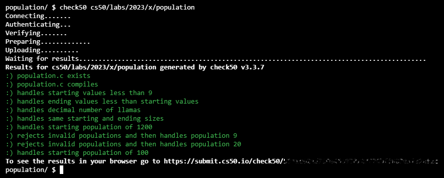
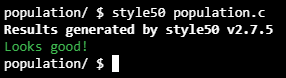
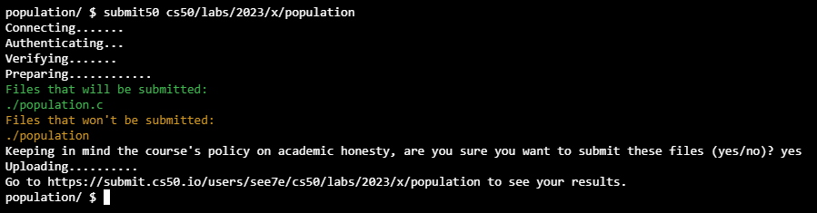

# [Lab 1: Population Growth](https://cs50.harvard.edu/x/2023/labs/1//#lab-1-population-growth)


>You are welcome to collaborate with one or two classmates on this lab, though it is expected that every student in any such group contribute equally to the lab.

- [Lab 1: Population Growth](#lab-1-population-growth)
  - [Background](#background)
  - [Getting Started](#getting-started)
  - [Implementation Details](#implementation-details)
    - [Hints](#hints)
    - [How to Test Your Code](#how-to-test-your-code)
  - [How to Submit](#how-to-submit)
  - [Resolution](#resolution)
- [Walkthrough](#walkthrough)
  - [Log Trace](#log-trace)

Determine how long it takes for a population to reach a particular size.

```bash
$ ./population
Start size: 100
End size: 200
Years: 9
```

## Background

Say we have a population of `n` llamas. Each year, `n / 3` new llamas are born, and `n / 4` llamas pass away.

For example, if we were to start with `n = 1200` llamas, then in the first year, `1200 / 3 = 400` new llamas would be born and `1200 / 4 = 300` llamas would pass away. At the end of that year, we would have `1200 + 400 - 300 = 1300` llamas.

To try another example, if we were to start with `n = 1000` llamas, at the end of the year, we would have `1000 / 3 = 333.33` new llamas. We can’t have a decimal portion of a llama, though, so we’ll truncate the decimal to get `333` new llamas born. `1000 / 4 = 250` llamas will pass away, so we’ll end up with a total of `1000 + 333 - 250 = 1083` llamas at the end of the year.

## Getting Started

Recall that Visual Studio Code (aka VS Code) is a popular “integrated development environment” (IDE) via which you can write code. So that you don’t have to download, install, and configure your own copy of VS Code, we’ll use a cloud-based version instead that has everything you’ll need pre-installed.

1.  Log into [code.cs50.io](https://code.cs50.io/) using your GitHub account and follow the on-screen instructions to set up your very own “codespace” for Visual Studio Code. Once your codespace loads, you should see that, by default, VS Code is divided into three regions. Toward the top of VS Code is your “text editor,” where you’ll write all of your programs. Toward the bottom is a “terminal window,” a command-line interface (CLI) that allows you to explore your codespace’s files and directories (aka folders), compile code, and run programs. And on the left is your file “explorer,” a graphical user interface (GUI) via which you can also explore your codespace’s files and directories.
2.  Once your codespace has loaded, close any **Welcome** tabs that might have opened by default
3.  Log into [submit.cs50.io](https://submit.cs50.io) using your GitHub account and click **Authorize cs50** to activate `check50`.
4.  Run `update50` in your codespace’s terminal window to ensure your codespace is up-to-date and, if prompted, click **Rebuild now**.

Once complete, start by clicking inside your terminal window, then execute `cd` by itself. You should find that its “prompt” resembles the below.
```bash
$
```

Click inside of that terminal window and then type
```bash
mkdir population
```

followed by Enter in order to make a directory called `population` in your codespace. Take care not to overlook the space between `mkdir` and `population` or any other character for that matter!

Here on out, to execute (i.e., run) a command means to type it into a terminal window and then hit Enter. Commands are case-sensitive, so be sure not to type in uppercase when you mean lowercase or vice versa.

Now execute
```bash
cd population
```

to move yourself into (i.e., open) that directory. Your prompt should now resemble the below.
```bash
population/ $
```

Click inside of that terminal window and then type
```bash
wget https://cdn.cs50.net/2022/fall/labs/1/population.c
```

followed by Enter in order to download a template file called `population.c` in your codespace. Take care not to overlook the space between `wget` and the following URL, or any other character for that matter! If all was successful, you should execute
```bash
ls
```

and see a file named `population.c`. Executing `code population.c` should open the file where you will type your code for this lab. If not, retrace your steps and see if you can determine where you went wrong!

## Implementation Details

Complete the implementation of `population.c`, such that it calculates the number of years required for the population to grow from the start size to the end size.

-   Your program should first prompt the user for a starting population size.
    -   If the user enters a number less than 9 (the minimum allowed population size), the user should be re-prompted to enter a starting population size until they enter a number that is greater than or equal to 9. (If we start with fewer than 9 llamas, the population of llamas will quickly become stagnant!)
-   Your program should then prompt the user for an ending population size.
    -   If the user enters a number less than the starting population size, the user should be re-prompted to enter an ending population size until they enter a number that is greater than or equal to the starting population size. (After all, we want the population of llamas to grow!)
-  Your program should then calculate the (integer) number of years required for the population to reach at least the size of the end value.
-   Finally, your program should print the number of years required for the llama population to reach that end size, as by printing to the terminal `Years: n`, where `n` is the number of years.

### Hints

-   If you want to repeatedly re-prompt the user for the value of a variable until some condition is met, you might want to use a `do ... while` loop. For example, recall the following code from lecture, which prompts the user repeatedly until they enter a positive integer.
    ```c
      int n;
      do
      {
          n = get_int("Positive Integer: ");
      }
      while (n < 1);
    ```
    
    How might you adapt this code to ensure a start size of at least 9, and an end size of at least the start size?
    
-   To declare a new variable, be sure to specify its data type, a name for the variable, and (optionally) what its initial value should be.
    -   For example, you might want to create a variable to keep track of how many years have passed.
-   To calculate how many years it will take for the population to reach the end size, another loop might be helpful! Inside the loop, you’ll likely want to update the population size according to the formula in the Background, and update the number of years that have passed.
    
-   To print an integer `n` to the terminal, recall that you can use a line of code like 
    ```c
      printf("The number is %i\n", n);
    ```
    
    to specify that the variable `n` should fill in for the placeholder `%i`.
    

### How to Test Your Code

Your program should behave per these examples below. But before, remeber to complile with `make`.

```bash
$ ./population
Start size: 1200
End size: 1300
Years: 1
```

```bash
$ ./population
Start size: -5
Start size: 3
Start size: 9
End size: 5
End size: 18
Years: 8
```

```bash
$ ./population
Start size: 20
End size: 1
End size: 10
End size: 100
Years: 20
```

```bash
$ ./population
Start size: 100
End size: 1000000
Years: 115
```

Execute the below to evaluate the correctness of your code using `check50`. But be sure to compile and test it yourself as well!

```bash
check50 cs50/labs/2023/x/population
```


Execute the below to evaluate the style of your code using `style50`.

```bash
style50 population.c
```


## How to Submit

In your terminal, execute the below to submit your work.

```bash
submit50 cs50/labs/2023/x/population
```


---

## Resolution

In order to fulfill the exercise requests we need to implement this code:
-   Prompt the user for a starting number of llamas
    ```c
    // start population
	int	start;

	start = 0;
	do
	{
		start = get_int("Start population size: ");
	}
	while (start < 9);
    ```

-   Prompt the user for a goal number of llamas
    ```c
    // ending population
	int	end;

	end = 0;
	do
	{
		end = get_int("End population size: ");
	} while (end < start);
    ```

-   Add and subtract llamas every "year" until we reach the goal number of llamas.
	Note that matematcaly <code><sup>n</sup>/<sub>3</sub> - <sup>n</sup>/<sub>4</sub></code> results in <code><sup>n</sup>/<sub>12</sub></code>, but in the second example as soon as we make <sup>9</sup>/<sub>12</sub> the compiler will truncate the result (`0.75`) to `zero`. And in *this* example will result in an **infinite loop**.
    ```c
    // years to the goal
	int	years;

	years = 0;
	while (start < end)
	{
		# start += start / 12;
		start += (start / 3) - (start / 4); // correct way
		years++;
	}
    ```

-   Print the number of years it took to reach the goal number of llamas

    ```c
    printf("Years: %i\n", years);
    ```

---

# Walkthrough

## Log Trace

```bash
cs50/labs/2023/x/population
:) population.c exists

**Log**  
checking that population.c exists...  
:) population.c compiles

**Log**  
running clang population.c -o population -std=c11 -ggdb -lm -lcs50...  
:) handles starting values less than 9

**Log**
running ./population...
sending input 8...  
sending input 8...  
checking that input was rejected...  
:) handles ending values less than starting values

**Log**  
running ./population...  
sending input 50...  
sending input 49...  
checking that input was rejected...  
:) handles decimal number of llamas

**Log**  
running ./population...  
sending input 1100...  
sending input 1192...  
checking for output "Years: 2"...  
checking that program exited with status 0...  
:) handles same starting and ending sizes

**Log**  
running ./population...  
sending input 100...  
sending input 100...  
checking for output "Years: 0"...  
checking that program exited with status 0...  
:) handles starting population of 1200

**Log**  
running ./population...  
sending input 1200...  
sending input 1300...  
checking for output "Years: 1"...  
checking that program exited with status 0...  
:) rejects invalid populations and then handles population 9

**Log**  
running ./population...  
sending input -5...  
sending input 3...  
sending input 9...  
sending input 5...  
sending input 18...  
checking for output "Years: 8"...  
checking that program exited with status 0...  
:) rejects invalid populations and then handles population 20

**Log**  
running ./population...  
sending input 20...  
sending input 1...  
sending input 10...  
sending input 100...  
checking for output "Years: 20"...  
checking that program exited with status 0...  
:) handles starting population of 100

**Log**  
running ./population...  
sending input 100...  
sending input 1000000...  
checking for output "Years: 115"...  
checking that program exited with status 0...
```

