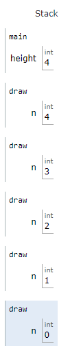
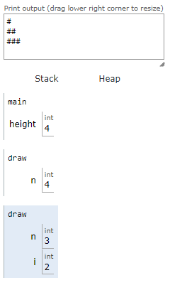

> This material is distributed by `Harvard © 2023 edX LLC`. It was copied during the execution of the Course, and have been modified due to my understanding and integrated to the previous Data Structure of `Programing Studies`.

<details> <summary>Table of Contents</summary>

- [Lecture 3](#lecture-3)
  - [Welcome! #](#welcome-)
  - [Algorithms](#algorithms)
  - [Running Time](#running-time)
  - [Linear and Binary Search](#linear-and-binary-search)
  - [Data Structures](#data-structures)
  - [Sorting](#sorting)
    - [Selection sort](#selection-sort)
    - [Bubble sort](#bubble-sort)
  - [Recursion](#recursion)
  - [Merge Sort](#merge-sort)
  - [Summing Up](#summing-up)
- [Section](#section)
- [Shorts](#shorts)
  - [Linear Search](#linear-search)
  - [Binary Search](#binary-search)
  - [Bubble Sort](#bubble-sort-1)
  - [Selection Sort](#selection-sort-1)
  - [Recursion](#recursion-1)
  - [Merge Sort](#merge-sort-1)
- [Exercises](#exercises)
  - [Practice Problems 3 #](#practice-problems-3-)
  - [Lab 3: Sort](#lab-3-sort)
  - [Problem Set 3](#problem-set-3)
  - [What to Do](#what-to-do)
  - [Advice](#advice)

</details>

# Lecture 3

<details>
<summary>Keywords, lookup in <a href="./src/transcripts/lecture3.md">transcript</a></summary>

- Efficiency
- Searching
- Linear search
- Running time, Imprecision
- Big O
- Upperbound
- Lowerbound
- Segmentation Fault
- Exit codes
- Data Structures
- Create your own types
- Structure
- Atribute
- csv
- read dynamically
- Sortting
- Recursion
- Base case
- improve time
- space

</details>

## Welcome! [#](https://cs50.harvard.edu/x/2023/notes/3/#welcome)

-   In week zero, we introduced the idea of an _algorithm_.
-   This week, we are going to expand upon our understanding of algorithms through pseudocode and into code itself.
-   Also, we are going to consider the efficiency of these algorithms. Indeed, we are going to be building upon our understanding of how to use some of the _lower-level_ concepts we discussed last week in building algorithms.

## Algorithms

-   Recall that last week you were introduced to the idea of an _array_, blocks of memory that are side-by-side with one another.
-   You can metaphorically imagine an array like a series of seven red lockers as follows:
    

-   We can imagine that we have an essential problem of wanting to know, “Is the number 50 inside an array?”
-   We can potentially hand our array to an algorithm, wherein our algorithm will search through our lockers to see if the number 50 is behind one of the doors: Returning the value true or false.
    
    
-   We can imagine various instructions we might provide our algorithm to undertake this task as follows:
    <pre><code>
    For each door from left to right
        If 50 is behind door
            Return true
    Return false // end of the loop
    </code></pre>
    
    Notice that the above instructions are called _pseudocode_: A human-readable version of the instructions that we could provide the computer.

-   A computer scientist could translate that pseudocode as follows:
    <pre><code>
    For i from 0 to n-1
        If 50 is behind doors[i]
            Return true
    Return false
    </code></pre>
    
    Notice that the above is still not code, but it is a pretty close approximation of what the final code might look like.

-   **Binary search** is a _search algorithm_ that could be employed in our task of finding the 50.
-   **Assuming that the values within the lockers have been arranged from smallest to largest**, the pseudocode for binary search would appear as follows:
    <pre><code>
    If there are no doors // error handling
        Return false
    If 50 is behind middle door
        Return true
    Else if 50 Less Than middle door
        Search left half
    Else if 50 Greater Than middle door
        Search right half
    </code></pre>

-   Using the nomenclature of code, we can further modify our algorithm as follows:
    <pre><code>
    If no doors
        Return false
    If 50 is behind doors[middle (n/2)]
        Return true
    Else if 50 Less Than doors[middle]
        Search doors[0] through doors[middle-1]
    Else if 50 Greater Than doors[middle]
        Search doors[middle+1] through doors[n-1]
    </code></pre>
    
    Notice, looking at this approximation of code, you can nearly imagine what this might look like in actual code.

## Running Time

-   _running time_ involves an analysis using [*Big O*](../../Other/big_o_notation.md) notation. Take a look at the following graph:
    
    
    
	In the above graph, the first algorithm is in `O(n)`. The second is in `O(n)` as well. The third is in `O(log⁡ n)`.

-   It’s the shape of the curve that shows the efficiency of an algorithm. Some common running times we may see are, **from lowest to fastest**:
    -   $O(n^2)$ *e.g [selection sort](#selection-sort), [bubble sort](#bubble-sort)*
    -   $O(n log⁡ n)$ *eg [merge sort](#merge-sort)*
    -   $O(n)$
    -   $O(log⁡ n)$
    -   $O(1)$

-   Of the running times above, $O(n^2)$ is considered the worst running time, $O(1)$ is the fastest.
-   Linear search was of order $O(n)$ because it could take $n$ steps in the worst case to run.
-   Binary search was of order $O(log⁡ n)$ because it would take fewer and fewer steps to run even in the worst case.

Programmers are interested in both the worst case, or _upper bound_, and the best case, or _lower bound_.
-   The $Ω$ symbol is **used to denote the best case of an algorithm**, such as $ΩO(n)$.
-   The $Θ$ symbol is **used to denote where the upper bound and lower bound are the same**, where the best case and the worst case running times are the same.

## Linear and Binary Search

Transforming the pseudocode defined previously, you can implement *linear search* ourselves by typing `code search.c` in your terminal window and by writing code as follows:

```c
#include <cs50.h>
#include <stdio.h>

int main(void)
{
    // An array of integers
    int numbers[] = {20, 500, 10, 5, 100, 1, 50};

    // Search for number
    int n = get_int("Number: ");
    for (int i = 0; i < 7; i++)
    {
        if (numbers[i] == n)
        {
            printf("Found\n");
            return 0;
        }
    }
    printf("Not found\n");
    return 1;
}
```

Notice that the line beginning with `int numbers[]` allows us to define the values of each element of the array as we create it. Then, in the `for` loop, we have an implementation of linear search.

-   We have now implemented linear search ourselves in C!
-   What if we wanted to search for a string within an array? Modify your code as follows:

    ```c
    #include <cs50.h>
    #include <stdio.h>
    #include <string.h>
    
    int main(void)
    {
        // An array of strings
        string strings[] = {"battleship", "boot", "cannon", "iron", "thimble", "top hat"};
    
        // Search for string
        string s = get_string("String: ");
        for (int i = 0; i < 6; i++)
        {
            if (strcmp(strings[i], s) == 0)
            {
                printf("Found\n");
                return 0;
            }
        }
        printf("Not found\n");
        return 1;
    }
    ```
    
    Notice that we cannot utilize ` == ` as in our previous iteration of this program. Instead, we have to use `strcmp`(), which comes from the `string.h` library.
    > In 42 Piscine, we had implemented this function [here](../../42/42_Walkthrugh/Lists/c03/files/ex00/ft_strcmp.c).

-   Indeed, running this code allows us to iterate over this array of strings to see if a certain string was within it. However, if you see a _segmentation fault_, where a part of memory was touched by your program that it should not have access to, do make sure you have `i < 6` noted above instead of `i < 7`.

-   We can combine these ideas of both numbers and strings into a single program. Type `code phonebook.c` into your terminal window and write code as follows:

    ```c
    #include <cs50.h>
    #include <stdio.h>
    #include <string.h>
    
    int main(void)
    {
        // Arrays of strings
        string names[] = {"Carter", "David"};
        string numbers[] = {"+1-617-495-1000", "+1-949-468-2750"};
    
        // Search for name
        string name = get_string("Name: ");
        for (int i = 0; i < 2; i++)
        {
            if (strcmp(names[i], name) == 0)
            {
                printf("Found %s\n", numbers[i]);
                return 0;
            }
        }
        printf("Not found\n");
        return 1;
    }
    ```
    
    Notice that Carter’s number begins with `+1-617` and David’s phone number starts with ‘1-949’. Therefore, `names[0]` is Carter and `numbers[0]` is Carter’s number.

-   While this code works, there are numerous inefficiencies. Indeed, there is a chance that people’s names and numbers may not correspond. Wouldn’t be nice if we could create our own data type where we could associate a person with the phone number?

## Data Structures

-   It turns out that C allows a way by which **we can create our own data types via a `struct`**. Modify your code as follows:

    ```c
    #include <cs50.h>
    #include <stdio.h>
    #include <string.h>
    
    typedef struct
    {
        string name;   // atribute
        string number; // atribute
    }
    person; // name of the structure
    
    int main(void)
    {
        person people[2]; // array of structures
    
        people[0].name = "Carter";
        people[0].number = "+1-617-495-1000";
    
        people[1].name = "David";
        people[1].number = "+1-949-468-2750";
    
        // Search for name
        string name = get_string("Name: ");
        for (int i = 0; i < 2; i++)
        {
            if (strcmp(people[i].name, name) == 0)
            {
                printf("Found %s\n", people[i].number);
                return 0;
            }
        }
        printf("Not found\n");
        return 1;
    }
    ```
    
    Notice that the code begins with `typedef struct` where a new datatype called `person` is defined. 
    Inside a `person` is a string called `name` and a `string` called number, they are **attributes** of the struct.
    In the `main` function, begin by creating an array of structures (*that is of type `person`*) called `people`  that is a size of 2.
    Then, we update the names and phone numbers of the two people in our `people` array. Most important, notice how the _dot notation_ such as `people[0].name` allows us to access the `person` at the 0th location and assign that individual a name. 
	
	In the future, the code will read from a data-base and store the information automatically in the array. 

## Sorting

-   _sorting_ is the act of taking an unsorted list of values and transforming this list into a sorted one.
-   When a list is sorted, searching that list is far less taxing on the computer. Recall that we can use binary search on a sorted list, but not on an unsorted one.
-   It turns out that there are many different types of sort algorithms. 

### Selection sort

is one such search algorithm.
-   The algorithm for Selection Sort in pseudocode is:
    <pre><code>
    For i from 0 to n–1
        Find smallest number between numbers[i] and numbers[n-1]
        Swap smallest number with numbers[i]
    </code></pre>

-   Consider the unsorted list as follows:
    <pre><code>
      5 2 7 4 1 6 3 0
      ^
    </code></pre>

-   Selection sort will begin by looking for the smallest number in the list and swap that number with our current position in the list. In this case, the zero is located and moved to our current position.
    <pre><code>
      0 | 2 7 4 1 6 3 5
    </code></pre>

-   Now, our problem has gotten smaller since we know at least the beginning of our list is sorted. So we can repeat what we did, starting from the second number in the list:
    <pre><code>
      0 | 2 7 4 1 6 3 5
          ^    
    </code></pre>

-   1 is the smallest number now, so we’ll swap it with the second number. We’ll repeat this again …
    <pre><code>
      0 1 | 7 4 2 6 3 5
            ^     
    </code></pre>

-   … and again…
    <pre><code>
      0 1 2 | 4 7 6 3 5
              ^
    </code></pre>

-   … and again…
    <pre><code>
      0 1 2 3 | 7 6 4 5
                ^
    </code></pre>

-   … and again …
    <pre><code>
      0 1 2 3 4 | 6 7 5
                  ^
    </code></pre>

-   and so on.


### Bubble sort

is another sorting algorithm that works by repeatedly swapping elements to “bubble” larger elements to the end.
-   The pseudocode for bubble sort is:
    <pre><code>
    Repeat n-1 times
    For i from 0 to n–2
        If numbers[i] and numbers[i+1] out of order
            Swap them
    </code></pre>

-   We’ll start with our unsorted list, but this time we’ll look at pairs of numbers and swap them if they are out of order:
    <pre><code>
    5 2 7 4 1 6 3 0
    ^ ^
    2 5 7 4 1 6 3 0
      ^ ^
    2 5 7 4 1 6 3 0
        ^ ^
    2 5 4 7 1 6 3 0
          ^ ^
    2 5 4 1 7 6 3 0
            ^ ^
    2 5 4 1 6 7 3 0
              ^ ^
    2 5 4 1 6 3 7 0
                ^ ^
    2 5 4 1 6 3 0 7
    </code></pre>

-   Now, the highest number is all the way to the right, so we’ve improved our problem. We’ll repeat this again:
    <pre><code>
    2 5 4 1 6 3 0 | 7
    ^ ^
    2 5 4 1 6 3 0 | 7
      ^ ^
    2 4 5 1 6 3 0 | 7
        ^ ^
    2 4 1 5 6 3 0 | 7
          ^ ^
    2 4 1 5 6 3 0 | 7
            ^ ^
    2 4 1 5 3 6 0 | 7
              ^ ^
    2 4 1 5 3 0 6 | 7
    </code></pre>

-   Now the two biggest values are on the right. We’ll repeat again:
    <pre><code>
      2 4 1 5 3 0 | 6 7
      ^ ^
      2 4 1 5 3 0 | 6 7
        ^ ^
      2 1 4 5 3 0 | 6 7
          ^ ^
      2 1 4 5 3 0 | 6 7
            ^ ^
      2 1 4 3 5 0 | 6 7
              ^ ^
      2 1 4 3 0 5 | 6 7
    </code></pre>

-   … and again …
    <pre><code>
      2 1 4 3 0 | 5 6 7
      ^ ^
      1 2 4 3 0 | 5 6 7
        ^ ^
      1 2 3 4 0 | 5 6 7
          ^ ^
      1 2 3 4 0 | 5 6 7
            ^ ^
      1 2 3 0 4 | 5 6 7
    </code></pre>

-   … and again …
    <pre><code>
      1 2 3 0 | 4 5 6 7
      ^ ^
      1 2 3 0 | 4 5 6 7
        ^ ^
      1 2 3 0 | 4 5 6 7
          ^ ^
      1 2 0 3 | 4 5 6 7
    </code></pre>

-   … and again …
    <pre><code>
      1 2 0 | 3 4 5 6 7
      ^ ^
      1 2 0 | 3 4 5 6 7
        ^ ^
      1 0 2 | 3 4 5 6 7
    </code></pre>

-   … and finally …
    <pre><code>
      1 0 | 2 3 4 5 6 7
      ^ ^
      0 1 | 2 3 4 5 6 7
    </code></pre>

-   Notice that, as we go through our list, we know more and more of it becomes sorted, so we only need to look at the pairs of numbers that haven’t been sorted yet.
-   Analyzing selection sort, we made only seven comparisons. Representing this mathematically, where _n_ represents the number of cases, it could be said that selection sort can be analyzed as:
	$(n-1) + (n-2) + (n-3) + ... + 1$
	$n(n-1)/2$
	$(n^2-n)/2$
	$n^2/2−n/2$.

-   Considering that mathematical analysis, $n^2$ is really the most influential factor in determining the efficiency of this algorithm. Therefore, selection sort is considered to be of the order of $O(n^2)$ in the worst case where all values are unsorted. Even when all values are sorted, it will take the same number of steps. Therefore, the best case can be noted as $Ω(n^2)$. Since both the upper bound and lower bound cases are the same, the efficiency of this algorithm as a whole can be regarded as $Θ(n^2)$.
-   Analyzing bubble sort, the worst case is $O(n^2)$. The best case is $Ω(n)$.
-   You can [visualize](https://www.cs.usfca.edu/~galles/visualization/ComparisonSort.html) a comparison of these algorithms.

## Recursion

-   How could we improve our efficiency in our sorting?
-   [_Recursion_](../../Other/recursion.md) is a concept within programming where a function calls itself. We saw this earlier when we saw…
    <pre><code>
    If no doors
        Return false
    If number behind middle door
        Return true
    Else if number Less Than middle door
        Search left half
    Else if number Greater Than middle door
        Search right half
    </code></pre>
    
    Notice that we are calling `search` on smaller and smaller iterations of this problem.

-   Similarly, in our pseudocode for Week 0, you can see where recursion was implemented:
    <pre><code>
    1  Pick up phone book
    2  Open to middle of phone book
    3  Look at page
    4  If person is on page
    5      Call person
    6  Else if person is earlier in book
    7      Open to middle of left half of book
    8      Go back to line 3
    9  Else if person is later in book
    10     Open to middle of right half of book
    11     Go back to line 3
    12 Else
    13     Quit
    </code></pre>

-   Consider how in Week 1 we wanted to create a pyramid structure as follows:
    <pre><code>
      #
      ##
      ###
      ####
    </code></pre>

-   To implement this using recursion, type `code recursion.c` into your terminal window and write code as follows:

    ```c
    #include <cs50.h>
    #include <stdio.h>
    
    void draw(int n);
    
    int main(void)
    {
        draw(1);
    }
    
    void draw(int n)
    {
        for (int i = 0; i < n; i++)
        {
            printf("#");
        }
        printf("\n");
    
        draw(n + 1);
    }
    ```
    
    Notice that the draw function calls itself. Further, note that your code may get caught in an infinite loop or a segmentation fault. 
    To break from this loop, if you get stuck, hit `ctrl-c` on your keyboard. The reason this creates an infinite loop is that there is nothing telling the program to end. There is no case where the program is done.

-   We can correct our code as follows:

    ```c
    #include <cs50.h>
    #include <stdio.h>
    
    void draw(int n);
    
    int main(void)
    {
        // Get height of pyramid
        int height = get_int("Height: ");
    
        // Draw pyramid
        draw(height);
    }
    
    void draw(int n)
    {
        // If nothing to draw - BASE CASE
        if (n <= 0)
        {
            return;
        }
    
        // Draw pyramid of height n - 1
        draw(n - 1);
    
        // Draw one more row of width n
        for (int i = 0; i < n; i++)
        {
            printf("#");
        }
        printf("\n");
    }
    ```
    
    Notice the _base case_ will ensure the code does not run forever. The line `if (n <= 0)` terminates the recursion because the problem has been solved. Every time `draw` calls itself, it calls itself by `n-1`.

         
    
    At some point, `n-1` will equal `0`, resulting in the `draw` function returning and the program will end.

## Merge Sort

-   We can now leverage recursion in our quest for a more efficient sort algorithm and implement what is called _merge sort_, a very efficient sort algorithm.
-   The pseudocode for merge sort is quite short:

    <pre><code>
    If only one number
        Quit
    Else
        Sort left half of number
        Sort right half of number
        Merge sorted halves
    </code></pre>

-   Consider the following list of numbers:
    <pre><code>
      7254
    </code></pre>

1.   Merge sort asks, “is this one number?” The answer is “no,” so the algorithm continues.

2.  Will now split the numbers down the middle (or as close as it can get) and sort the left half of numbers.
    <pre><code>
      72|54
    </code></pre>

3.  Would look at these numbers on the left and ask, “is this one number?” Since the answer is no, it would then split the numbers on the left down the middle.
    <pre><code>
      7|2
    </code></pre>

4.  Will again ask , “is this one number?” The answer is yes this time! Therefore, it will quit this task and return to the last task it was running at this point:
    <pre><code>
      72|54
    </code></pre>

5.   Will sort the numbers on the left.
    <pre><code>
      27|54
    </code></pre>

6.  Now, we return to where we left off in the pseudocode now that the left side has been sorted. A similar process of steps 3-5 will occur with the right-hand numbers. This will result in:
    <pre><code>
      27|45
    </code></pre>

7.  Both halves are now sorted. Finally, the algorithm will merge both sides. It will look at the first number on the left and the first number on the right. It will put the smaller number first, then the second smallest. The algorithm will repeat this for all numbers, resulting in:
    <pre><code>
      2457
    </code></pre>

8.  Merge sort is complete, and the program quits.

Merge sort is a very efficient sort algorithm with a worst case of O(nlog⁡n). The best case is still $Ω(n log ⁡n)$ because the algorithm still must visit each place in the list. Therefore, merge sort is also Θ(nlog⁡n) since the best case and worst case are the same.
-   A final [visualization](https://www.youtube.com/watch?v=ZZuD6iUe3Pc) was shared.

## Summing Up

In this lesson, you learned about algorithmic thinking and building your own data types. Specifically, you learned…

-   Algorithms.
-   Big _O_ notation.
-   Binary search and linear search.
-   Various sort algorithms, including bubble sort, selection sort, and merge sort.
-   Recursion.

---
# Section 
> [Transcript](./src/transcripts/section3.md)

- How should we compare algorithms?
	- Running time
	- Number of steps (*Big O*)
- When are structs useful?
- What is recursion?
- Running Time
	- For any input, what is the **most number of steps** my algorithm will ever take?
	- How many steps will my algorithm take for the very **worst case input**?

---

# Shorts

## Linear Search 
> [Transc](./src/transcripts/shorts3_linear_srch.md)

## Binary Search
> [Transc](./src/transcripts/shorts3_binary_srch.md)

## Bubble Sort
> [Transc](./src/transcripts/shorts3_bubble_srt.md)

## Selection Sort 
> [Transc](./src/transcripts/shorts3_selection_srt.md)

## Recursion
> [Transc](./src/transcripts/shorts3_recursion.md)

## Merge Sort
> [Transc](./src/transcripts/shorts3_merge.srt.md)

---

# Exercises

## Practice Problems 3 [#](https://cs50.harvard.edu/x/2023/problems/3/#week-3-practice-problems)

In addition to this week’s lab and problem set, you’re welcome to try any of these (optional!) practice problems:

-   [Recursive `atoi`](./src/recursive_atoi.c) [#](https://cs50.harvard.edu/x/2023/problems/3/atoi/), for practice creating recursive functions
    > My biggest difficulty in terms of recursion is to think backwards, to create the solution and then recreate it in a reverse manner.
-   Average Temperatures [#](https://cs50.harvard.edu/x/2023/problems/3/temps/), for practice working with `struct`'s and sorting algorithms
-   Max [#](https://cs50.harvard.edu/x/2023/problems/3/max/), for practice passing arrays to functions and finding maximum values
-   Snackbar [#](https://cs50.harvard.edu/x/2023/problems/3/snackbar/), for practice using `struct`'s and writing a linear search algorithm

## [Lab 3: Sort](./lab3.md)

## Problem Set 3
>Collaboration on problem sets is not permitted except to the extent that you may ask classmates and others for help so long as that help does not reduce to another doing your work for you, per the course’s policy on [academic honesty](https://cs50.harvard.edu/x/2023/psets/3//../../syllabus/#academic-honesty).
>
>The staff conducts random audits of submissions to CS50x. Students found to be in violation of this policy will be removed from the course. Students who have already completed CS50x, if found to be in violation, will have their CS50 Certificate permanently revoked.

## What to Do
> Be sure you have completed [Lab 3](https://cs50.harvard.edu/x/2023/psets/3/../../labs/3/) before beginning this problem set.

1.  Log into [code.cs50.io](https://code.cs50.io) using your GitHub account
2.  Run `update50` in your codespace’s terminal window to ensure your codespace is up-to-date and, when prompted, click **Rebuild now**
3.  Submit [Plurality](./plurality.md) [#](https://cs50.harvard.edu/x/2023/psets/3/plurality/)
4.  Submit one of:
    -   [Runoff](./runoff.md) [#](https://cs50.harvard.edu/x/2023/psets/3/runoff/), if feeling less comfortable
    -   [Tideman](./tidman.md) [#](https://cs50.harvard.edu/x/2023/psets/3//tideman/), if feeling more comfortable

If you submit both Runoff and Tideman, we’ll record the higher of your two scores.

## Advice

-   Try out any of David’s programs from class via [Week 3](https://cs50.harvard.edu/x/2023/psets/3//../../weeks/3/)’s sandboxes.
-   If you see any errors when compiling your code with `make`, focus first on fixing the very first error you see, scrolling up as needed. If unsure what it means, try asking `help50` for help. For instance, if trying to compile `plurality`, and
    
    ```bash
    make plurality
    ```
    
    is yielding errors, try running
    
    ```bash
    help50 make plurality
    ```
    
    instead!
